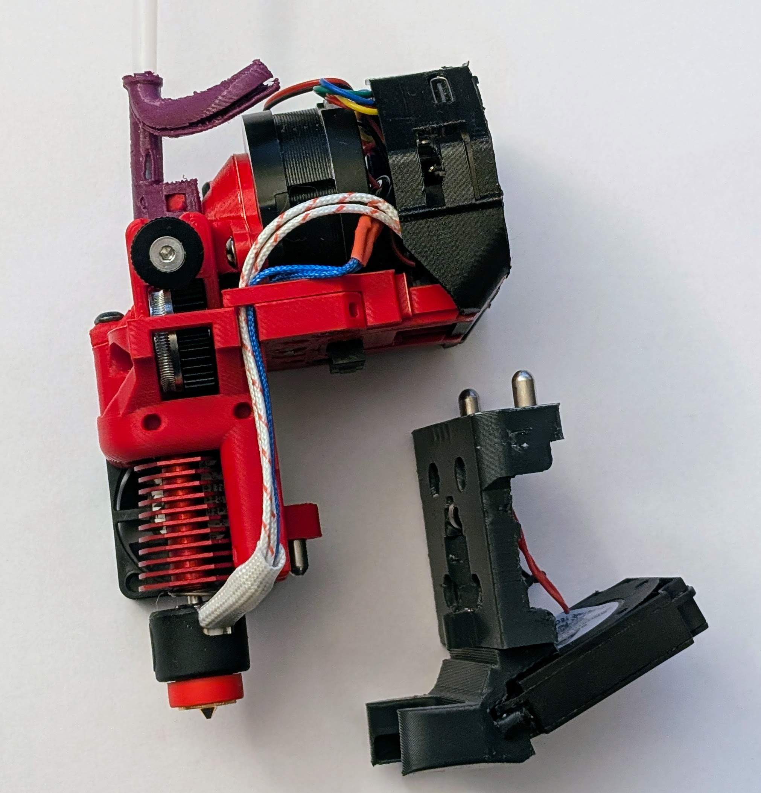
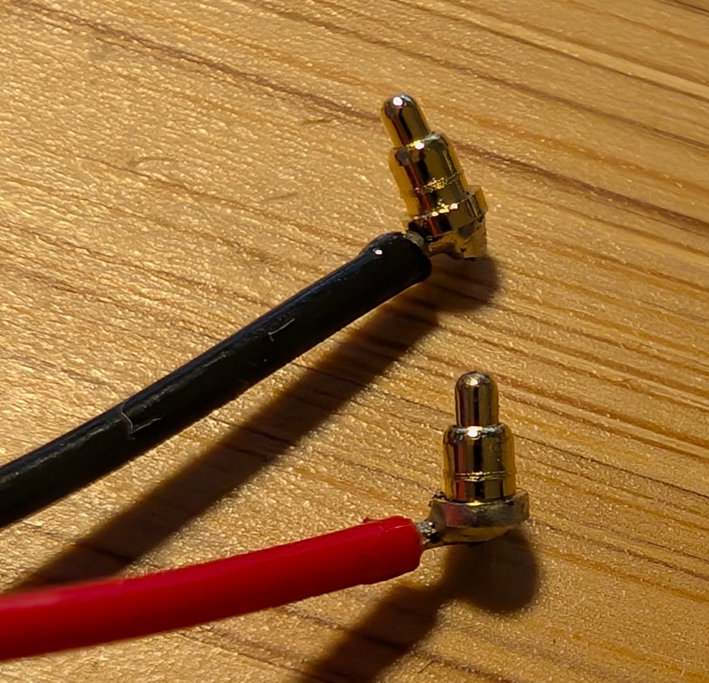
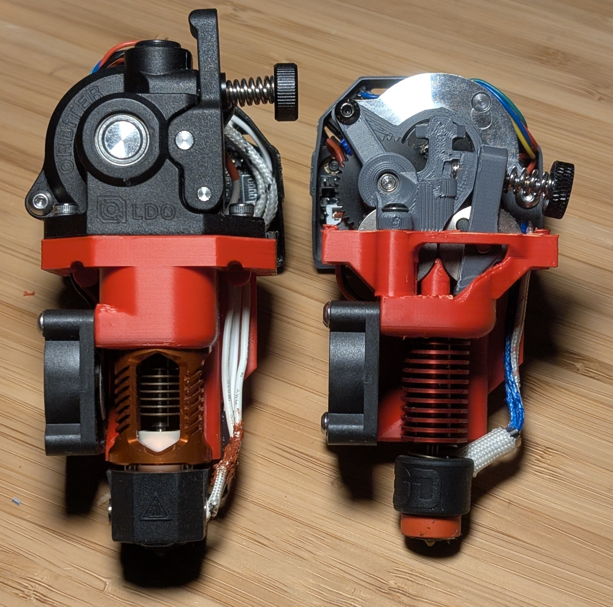

# What is this?

A minimalistic 3d printer toolhead design, build from ground up for tool changing and primarily the Voron Family of printers.
Inspired by [Tapchanger](https://github.com/viesturz/tapchanger) and [Stealthchanger](https://github.com/DraftShift/StealthChanger). But not getting into  [PitStop](https://mihaidesigns.com/pitstop3/) territory yet.

## How is this different?

ClickChanger is a yet another vertically attached design, but building on previous experiences, but here are some design directions it focuses on:
* A hotend based nozzle probe, like Revo PZ, not requiring the smooth vertical movement by the docking mechanism
* Rigid connection between the Y rail and hotend's heatsink, minimizing thermal expansion differences between toolheads
* A Shared part cooling fan integrated in the shuttle, connected via Pogo pins
* A "naked" toolhead, allowing for better cooling and overall less weight.

And keeping the features from other designs:

* Vertical motion to attach/detach the toolhead
* No wires to the shuttle, single cable to each toolhead

# Dragons be here

This is still in development/testing, there are no instructions, only a few extruders/hotends are supported.
See [TapChanger](https://github.com/viesturz/tapchanger) for my docking/wiring setup.

### Roadmap

Some of next directions this is going, in no particular order

* Get to 1000+ toolcahanges without fail
* CPAP support
* Beacon probe support

# Supported hotends

* Revo Voron
* Dragon or Dragon High flow
* Rapido

# Supported extruders

* HGX Large Gears - personal favorite of mine, great for flexibles; lowest weight and integrated strain relief.
* HGX Large Gears V2
* Orbiter V2
* Sherpa mini and compatibles

# Supported toolboards
* Bitgtreetach EBB36 and compatibles
* Mellow Fly SHT36 V2 and Pro
* LDO Nitehawk (untested)

# BOM

**Shuttle**

* 2x 4x12mm rounded end steel pins
* 1x 4x6x6mm bushing; preferrably the hybrid bushings for smoother slide
* 1x 3x8mm steel pin
* 1x 3x6x2.5mm bearing (3x6x3 works too)
* 1x 4010 centrifugal fan; 15000 rpm recommended since you are running a single fan.
* 2x 6x3mm magnet

**Shuttle CPAP**

* Coming up

**Toolhead**

* A supported extruder, toolhead, toolboard
* 1x 4mm x12mm round end steel pins
* 2x 4x6x6 mm bushing
* a Omron D2F limit switch or compatible
* 30x30x10 or 30x30x7 axial fan for hotend cooling
* 1x m2x6 **socket head** screw
* 2x 6x3mm magnet
* 2x 3.5mm [pogo pin](https://www.aliexpress.com/w/wholesale-pogo-pin-3mm.html), not needed for CPAP
* Some heastset inserts and m3 screws for toolhead mounting

**Dock**

Depends on the dock mounting method, coming up.

# Assembly instructions

Coming up

# Revision log

## 0.9 - Small improvements

Added:

* Rapido extruder base
* Nitehawk toolbard cage

Small refinements across the board:

* HGX Lite gears 2 refinements
* Fan shroud refinements
* Better fit for some holes

## 0.8 - It prints!

Introduced pogo pins for the fan connection and a new wiring holder.

Full PTFE tube channel for HGX - better for flexibles.

Assembly is quite repeatable now.

Printing reasonably stable now, hundreads of toolchanges but still expect some warts.

## 0.1 - It clicks!

There is an initial BOM, the click force is good, assembly is repeatable, building two and putting to the test.

