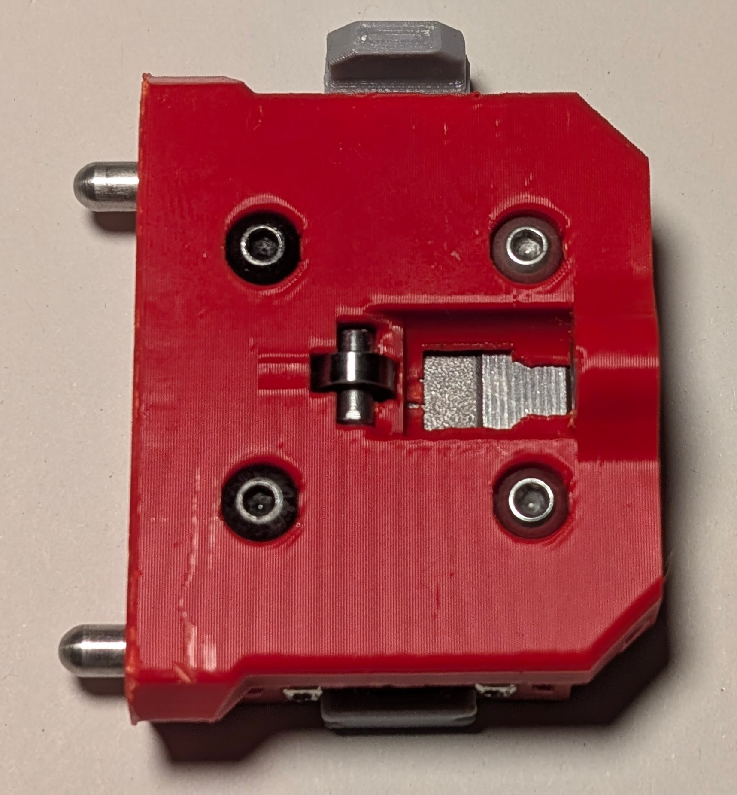

# What is this?

A minimalistic 3d printer toolhead design, build from ground up for tool changing and primarily the Voron Family of printers.
Inspired by [Tapchanger](https://github.com/viesturz/tapchanger) and [Stealthchanger](https://github.com/DraftShift/StealthChanger). But not getting into  [PitStop](https://mihaidesigns.com/pitstop3/) territory yet.

## How is this different?

ClickChanger is a yet another vertically attached design, but building on previous experiences, but here are some design directions it focuses on:
* A hotend based nozzle probe, like Revo PZ, not requiring smooth vertical movement
* Rigid connection between the Y rail and hotend's heatsink, minimizing thermal expansion differences between toolheads.
* Shared part cooling fan integrated in the shuttle
* A "naked" toolhead, allowing for better cooling and overall less weight.

And keeping the features from other designs:

* Vertical motion to attach/detach the toolhead
* No wires to the shuttle, single cable to each toolhead

# Dragons be here

This is still in development/testing, there are no instructions, only a few extruders/hotends are supported.
See [TapChanger](https://github.com/viesturz/tapchanger) for my docking/wiring setup.

# BOM

**Shuttle**

* 2x 4x12mm rounded end steel pins
* 1x 4x6x6mm bushing
* 1x 3x7mm steel rod
* 1x 3x6x2.5mm bearing (3x6x3 works too)
* 4010 centrifugal fan

**Toolhead** (each)

* 1x 4mm x12mm round end steel pins
* 2x 4x6x6 mm bushing
* 1x m2x4 socket cap screw
* a micro limit switch, Omron D2F or similar
* 30x30x10 axial fan
* A supported extruder, toolhead, toolboard

# Revision log

## 0.1 - It clicks!

There is an initial BOM, the click force is good, assembly is repeatable, building two and putting to the test.

